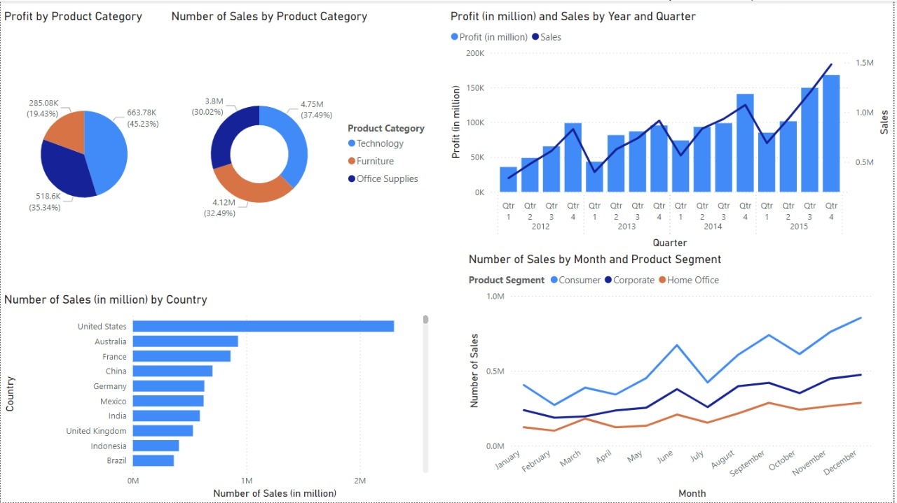

# Power BI Sales Dashboard Project

This repository contains a Power BI dashboard showcasing sales analysis for different product categories, countries, and time periods. The data used for this dashboard is stored in a CSV file. The dashboard includes visualizations for profit and sales trends, along with segmented data for detailed insights.

## Dashboard Overview



### Key Visualizations:
1. **Profit by Product Category**: Pie chart showing profit breakdown by Technology, Furniture, and Office Supplies.
2. **Number of Sales by Product Category**: Donut chart visualizing the number of sales for each product category.
3. **Profit and Sales by Year and Quarter**: Line and bar chart depicting profit and sales growth over time.
4. **Number of Sales by Country**: Bar chart showing the number of sales by different countries.
5. **Number of Sales by Month and Product Segment**: Line chart detailing monthly sales segmented by Consumer, Corporate, and Home Office segments.

## Data

The dataset used for this dashboard is stored in the [Amazon Data CSV](./Amazone%20data.csv) file.

### CSV File Columns:
- **Product Category**: Technology, Furniture, Office Supplies.
- **Profit**: Profit in million units.
- **Sales**: Sales in million units.
- **Year/Quarter**: Time period for sales and profit.
- **Country**: Sales performance by country.

## How to Use the Dashboard

1. Download the CSV file `Amazone data.csv` from this repository.
2. Open Power BI Desktop and load the CSV file.
3. Visualizations are pre-built based on the CSV data, but you can customize or create new visualizations based on your analysis requirements.

## Features

- **Trend Analysis**: Analyze sales and profit growth over time.
- **Product Category Analysis**: Compare sales and profit across different product categories.
- **Geographical Insights**: Understand which countries drive the highest sales.
- **Segmented Insights**: Review sales performance across different customer segments.

## Requirements

- Power BI Desktop
- CSV file (`Amazone data.csv`)

## Setup

1. Clone the repository:
    ```bash
    git clone https://github.com/hariharanrb7/powerbi-sales-dashboard.git
    ```
2. Open Power BI Desktop.
3. Load the `Amazone data.csv` file into Power BI.
4. Explore and interact with the dashboard.
